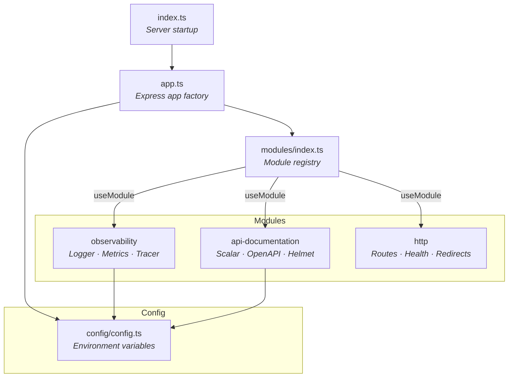

<div align="center">
  <h1>Node.js + TypeScript Modular Boilerplate</h1>

  <p>A modular Node.js + Express + TypeScript boilerplate with observability, API documentation, and esbuild.</p>

  <p>
    <a href="https://www.typescriptlang.org/"></a>
    <a href="https://expressjs.com/"></a>
    <a href="https://esbuild.github.io/"></a>
  </p>
</div>

## Features

- **Modular architecture** — plug-and-play modules registered via `useModule(app, name)`
- **Observability** — structured logging (pino), Prometheus metrics, OpenTelemetry tracing
- **API Documentation** — Scalar-powered OpenAPI docs with helmet CSP
- **Fast builds** — esbuild for sub-second bundling
- **Testing** — Jest with per-module unit tests
- **Code quality** — Biome for linting and formatting, Husky + commitlint for git hooks

## Architecture



### How Modules Work

Each module exports a single `implement*` function that receives the Express `Application` and registers its middleware/routes:

```typescript
// app.ts
useModule(app, "observability");
useModule(app, "api-documentation");
useModule(app, "http");
```

The module registry (`modules/index.ts`) maps names to implementations:

```typescript
const modules: Record<string, (app: Application) => void> = {
  observability: implementObservability,
  "api-documentation": implementAPIDocumentation,
  http: implementHTTP,
};
```

To add a new module, create a folder under `src/modules/`, export an `implement*` function, and register it in the map.

## Quick Start

```bash
# Install dependencies
npm install

# Build
npm run build

# Run
npm start
```

## Commands

| Command            | Description                |
| ------------------ | -------------------------- |
| `npm run build`    | Build with esbuild         |
| `npm run dev`      | Watch mode (nodemon + tsx) |
| `npm start`        | Start server (port 5000)   |
| `npm test`         | Run Jest tests             |
| `npm run lint`     | Lint with Biome            |
| `npm run lint:fix` | Auto-fix lint issues       |
| `npm run format`   | Format with Biome          |

## Endpoints

| Method | Endpoint        | Description        |
| ------ | --------------- | ------------------ |
| GET    | `/`             | Hello message      |
| GET    | `/health`       | Health check       |
| GET    | `/ready`        | Readiness check    |
| GET    | `/api/health`   | API health check   |
| GET    | `/metrics`      | Prometheus metrics |
| GET    | `/docs`         | API documentation  |
| GET    | `/openapi.yaml` | OpenAPI spec       |

## Project Structure

```
src/
├── index.ts                  # Server startup (app.listen)
├── app.ts                    # Express app factory + module registration
├── config/
│   └── config.ts             # Environment configuration
├── modules/
│   ├── index.ts              # Module registry (useModule / useAllModules)
│   ├── observability/
│   │   ├── index.ts          # Registers logger, metrics middleware
│   │   ├── logger.ts         # pino + pino-http structured logging
│   │   ├── metrics.ts        # Prometheus counters & histograms
│   │   └── tracer.ts         # OpenTelemetry tracing
│   ├── scalar/
│   │   └── scalar.ts         # Scalar API docs + helmet CSP
│   └── http/
│       └── index.ts          # Application routes
└── tests/
    ├── index.test.ts         # Integration tests
    └── modules/
        ├── index.test.ts     # Module registry tests
        ├── observability.test.ts
        ├── http.test.ts
        └── scalar.test.ts
```

## Observability

### Logging (pino + pino-http)

Structured JSON logs suitable for Loki ingestion. Control log level via `LOG_LEVEL` env var.

```bash
LOG_LEVEL=debug npm run dev
```

### Metrics (Prometheus)

Exposed at `GET /metrics`. Tracks:

- `http_requests_total` — counter with method, route, status_code labels
- `http_request_duration_seconds` — histogram with configurable buckets

### Tracing (OpenTelemetry)

Exports traces via OTLP/gRPC to the endpoint configured in `OPENTELEMETRY_URL`.

## Environment Variables

| Variable             | Default                   | Description                    |
| -------------------- | ------------------------- | ------------------------------ |
| `NODE_ENV`           | `development`             | Environment mode               |
| `HOST`               | `0.0.0.0`                 | Server bind address            |
| `PORT`               | `5000`                    | Server port                    |
| `LOG_LEVEL`          | `info` (`silent` in test) | pino log level                 |
| `OPENTELEMETRY_URL`  | `http://localhost:4317`   | OTLP collector endpoint        |
| `SCALAR_ENABLED`     | `false`                   | Enable API docs at `/docs`     |
| `OPEN_API_SPEC_PATH` | `.`                       | Path to OpenAPI spec directory |
